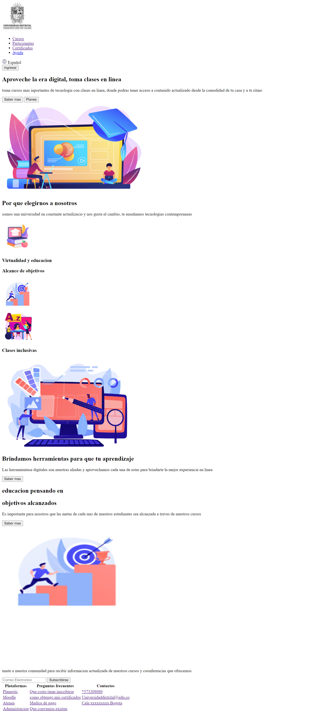
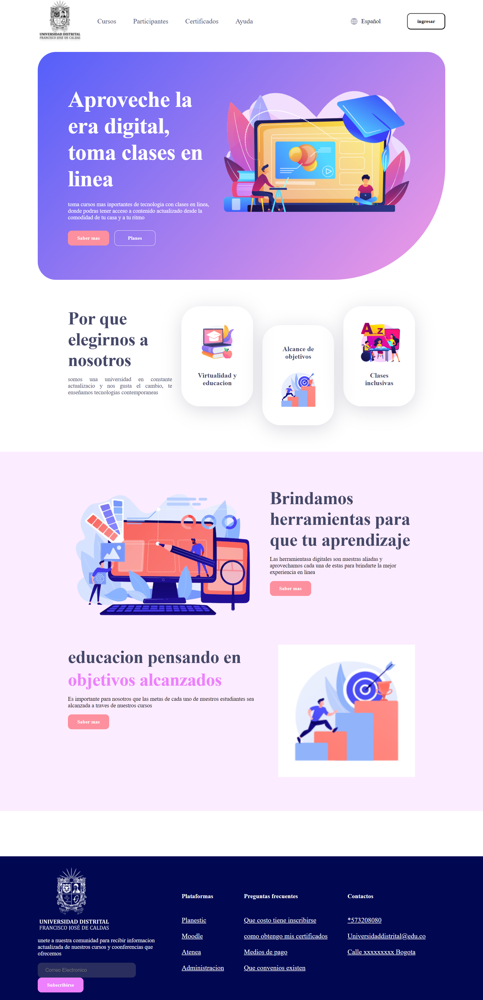

<h1>Taller 9 Luis Hernando Lopez</h1>

<h2> Información</h2>

Curso: full Stack Basico - Grupo 1

Profesor: Cristian Patiño

<h2> Punto 1: Link figma</h2>

<a href="https://www.figma.com/file/H7ij12dN164IuQ60i66gsk/Luis_-_Ejercicio-FIGMA?type=design&node-id=8%3A215&mode=design&t=etO2Hj3o0jSskuDe-1" target="_blank">Link de Figma</a>

<h2>PUNTO 2: HTML</H2>

<h2>PUNTO 3: CSS</H2>

